This is a [Next.js](https://nextjs.org) project bootstrapped with [`create-next-app`](https://github.com/vercel/next.js/tree/canary/packages/create-next-app).

## Getting Started

First, run the development server:

```bash
npm run dev
# or
yarn dev
# or
pnpm dev
# or
bun dev
```

Open [http://localhost:3000](http://localhost:3000) with your browser to see the result.

You can start editing the page by modifying `app/page.js`. The page auto-updates as you edit the file.

This project uses [`next/font`](https://nextjs.org/docs/app/building-your-application/optimizing/fonts) to automatically optimize and load [Geist](https://vercel.com/font), a new font family for Vercel.

## Learn More

To learn more about Next.js, take a look at the following resources:

- [Next.js Documentation](https://nextjs.org/docs) - learn about Next.js features and API.
- [Learn Next.js](https://nextjs.org/learn) - an interactive Next.js tutorial.

You can check out [the Next.js GitHub repository](https://github.com/vercel/next.js) - your feedback and contributions are welcome!

## Deploy on Vercel

The easiest way to deploy your Next.js app is to use the [Vercel Platform](https://vercel.com/new?utm_medium=default-template&filter=next.js&utm_source=create-next-app&utm_campaign=create-next-app-readme) from the creators of Next.js.

Check out our [Next.js deployment documentation](https://nextjs.org/docs/app/building-your-application/deploying) for more details.


## Laporan Praktikum

|  | Pemrograman Berbasis Framework 2024 |
|--|--|
| NIM |  2241720089 |
| Nama |  Putra Nindya Yuwana |
| Kelas | TI - 3C |
  

### Praktikum 1: Preparation

1. npx create-next-app@15.2.1 state-management-praktikum


2. npm install zustand @reduxjs/toolkit react-redux next-redux-wrapper swr	 

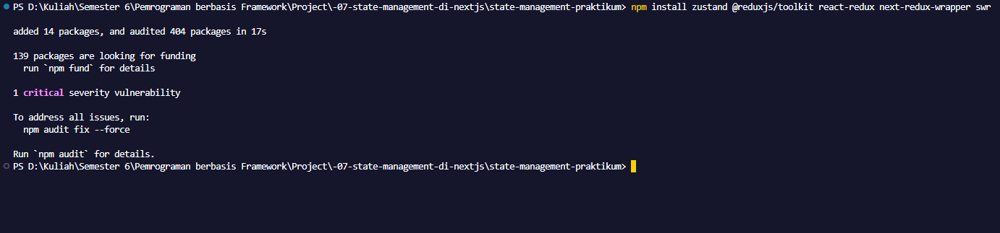


### Praktikum 2: React Context untuk State Global Sederhana

1. Buat Context	

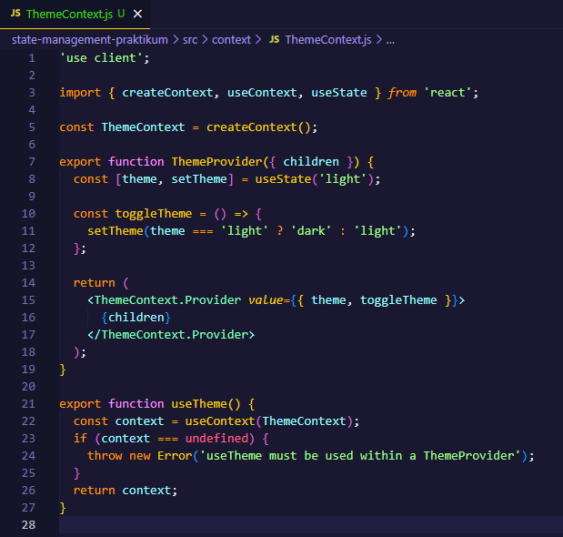

2. Implementasi di Komponen	 

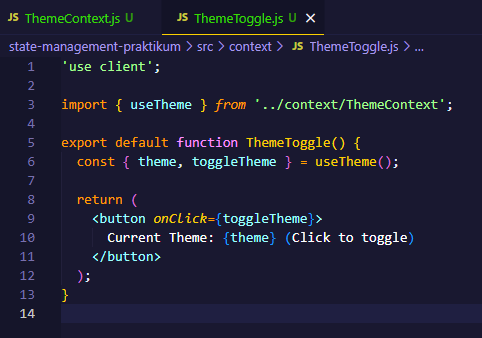

3. Wrap Aplikasi	 

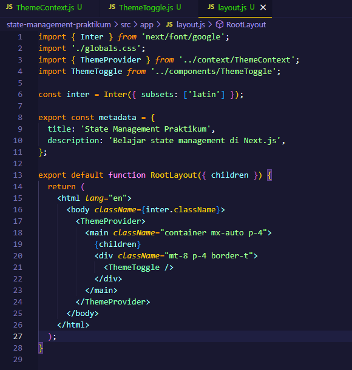

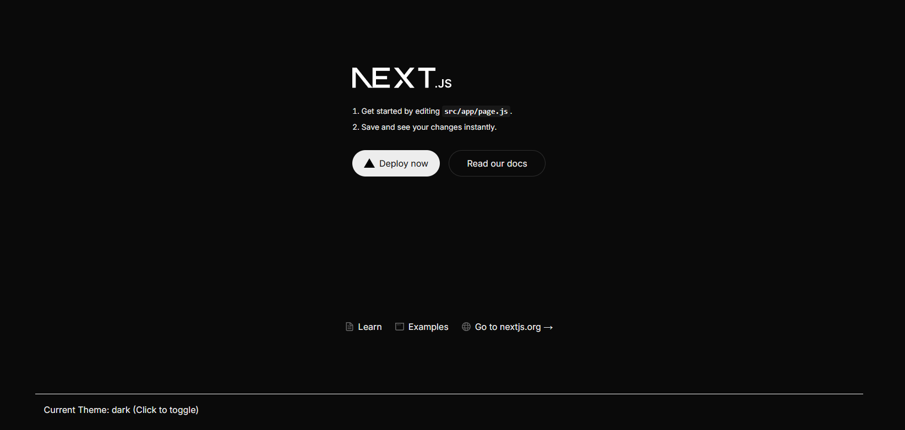


### Praktikum 3: Zustand untuk State Management Kompleks

1. Buat Store

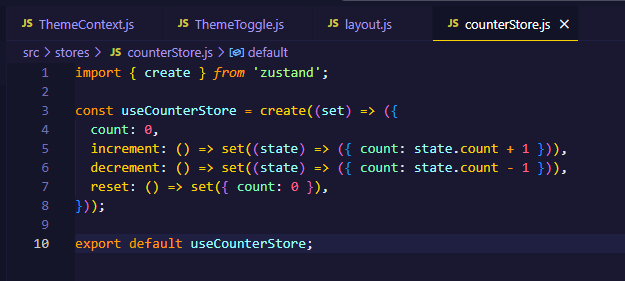

2. Implementasi Komponen	 

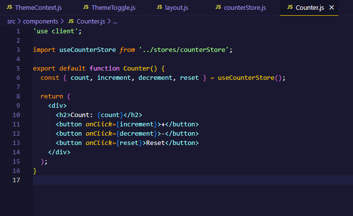

3. Gunakan Komponen dalam halaman

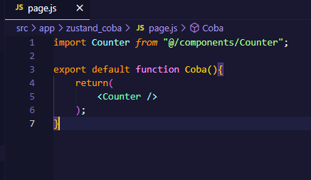

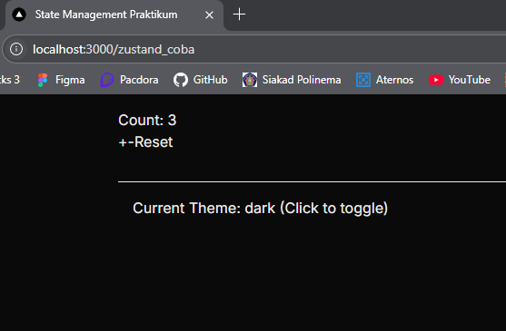


### Praktikum 4: Redux Toolkit dengan SSR Support

1. Setup Redux	 

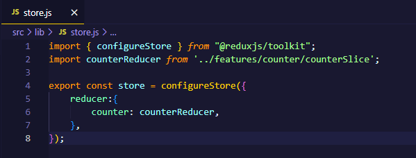

2. Buat Slice	 

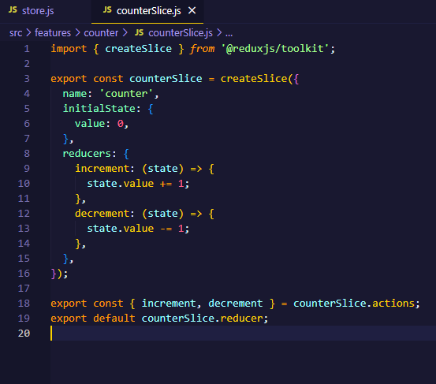

3. Provider Setup	 

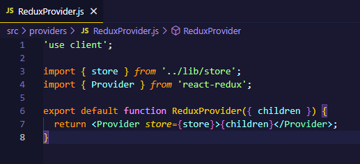

4. Implementasi Komponen	 

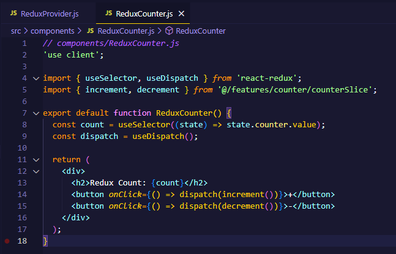

5. Gunakan Komponen dalam halaman	 
 
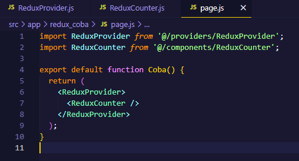

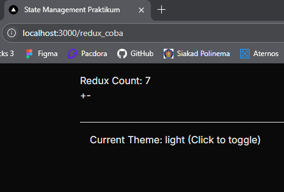


### Praktikum 5: Data Fetching dengan SWR

1. Implementasi Data Fetching	 

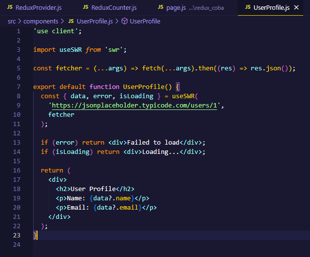

2. Gunakan Komponen dalam halaman	

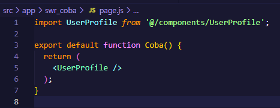

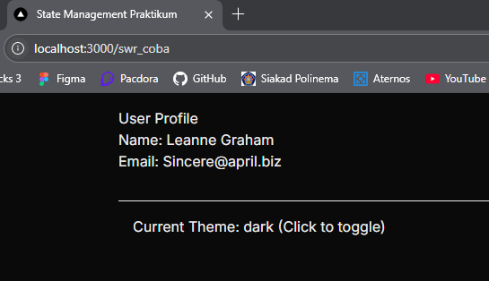
 

### Praktikum 6: URL State Management

1. Implementasi URL State	 

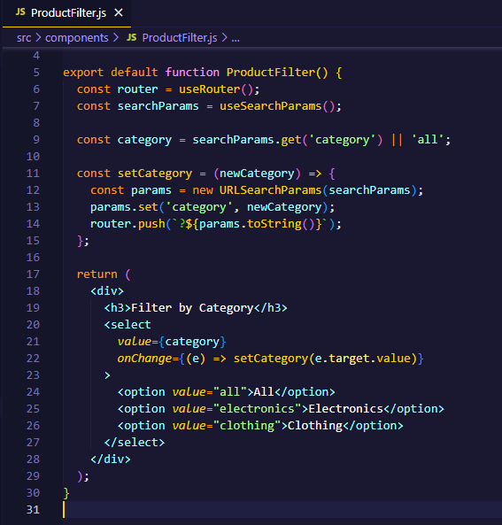

2. Gunakan Komponen dalam halaman

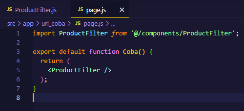
 
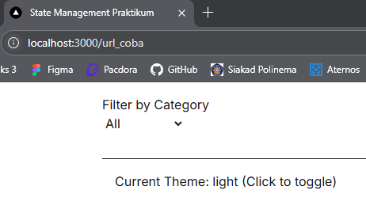


### Tugas


1. Bandingkan performa antara Context API, Zustand, dan Redux

    - Context API
        - Built-in React, tidak butuh library tambahan. 
        - Cocok untuk state global yang sederhana (seperti tema, bahasa, login).
        - Kurang efisien jika digunakan untuk state yang sering berubah (karena memicu re-render global).
        - Tidak memiliki DevTools bawaan. Tidak scalable untuk proyek besar.
        - Cocok untuk proyek kecil atau menengah yang tidak terlalu kompleks.

    - Zustand
        - Library ringan dan tidak memerlukan provider. 
        - Sangat efisien dalam re-render, hanya komponen yang mengakses state yang akan re-render. 
        - Support asynchronous secara bawaan. 
        - Bisa digunakan di dalam maupun luar komponen React. 
        - Cocok untuk proyek menengah hingga besar yang ingin tetap sederhana. 
        - Mudah dipelajari dan digunakan. 
        - Mendukung middleware, persistence, dan DevTools.

    - Redux (dengan Redux Toolkit) 
        - Cocok untuk proyek besar dan kompleks. 
        - Memiliki DevTools lengkap, logging, dan time-travel debugging. 
        - Support middleware seperti redux-thunk dan redux-saga untuk async action. 
        - Boilerplate awal banyak, tapi bisa disederhanakan dengan Redux Toolkit. 
        - Struktur kode lebih ketat dan terorganisir. 
        - Cocok untuk tim besar yang memerlukan standar dan dokumentasi jelas.


2. Diskusikan kapan sebaiknya menggunakan masing-masing solusi

    - Context API: jika state sederhana dan aplikasi kecil. 
    - Zustand: jika ingin performa bagus dengan setup ringan. 
    - Redux: jika aplikasi besar, kompleks, dan butuh kontrol penuh atas state.


~ ~ TERIMA KASIH ~ ~


